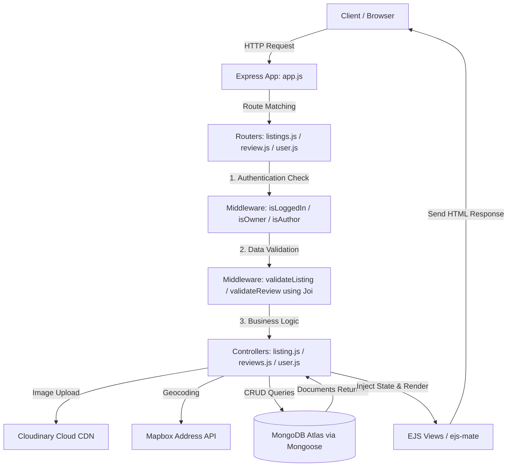

# TripNest

# Project Document: TripNest 

Welcome to the project documentation for **TripNest** (also referred to as *Wanderlust*), a full-stack, Airbnb-style travel booking and accommodation marketplace platform. 

This document provides a comprehensive overview of the application, detailing the tools, technologies, key features, architecture, and its primary strengths and areas for future improvement.

---

## 1. Overview of Project

**TripNest** is a full-stack web application designed to connect travelers looking for unique lodgings with hosts who want to rent out properties. The platform mimics core functionalities of Airbnb, allowing users to:
*   **Browse Properties:** View dynamic accommodation listings categorized into different niches (e.g., Pools, Farms, Arctic, Castles).
*   **Detailed View:** Examine listing profiles including price, description, images, owner details, and a geolocated map.
*   **Hosts Panel:** Create, update, and manage property listings with cloud-stored imagery.
*   **Community Reviews:** Leave review ratings (1 to 5 stars) and comments on properties.
*   **Secure Accounts:** Sign up, log in, and securely manage ownership permissions.

The user interface uses a modern, card-based layout featuring responsive grid setups, interactive mapping widgets, and crisp typography.

---

## 2. Tools and Technologies

The application follows the classic **MERN/MEN stack** design, utilizing Server-Side Rendering (SSR) via Express and EJS.

| Layer | Technology / Library | Purpose |
| :--- | :--- | :--- |
| **Frontend** | **Embedded JavaScript (EJS)** | Template engine for rendering dynamic views on the server |
| | **EJS-Mate** | Advanced layout engine to enable partial views and boilerplate layouts |
| | **Bootstrap 5** | Responsive layout grid, forms, navigation bar, and component styling |
| | **FontAwesome 6** | Modern vector icon integration |
| | **Google Fonts** | Custom typography featuring *"Plus Jakarta Sans"* |
| | **Mapbox GL JS** | Interactive client-side map rendering and navigation |
| **Backend** | **Node.js** | Server-side JavaScript runtime environment |
| | **Express.js** | Minimalist web application framework for routing and middleware |
| | **Passport.js & Passport-Local** | Modular user authentication and credential verification |
| | **Joi** | Object schema validation for listings and reviews (API security layer) |
| | **Multer** | Middleware for handling `multipart/form-data` uploads (listing images) |
| | **Mapbox SDK Geocoding** | Translates textual addresses to geographic coordinates on listing creation |
| | **Method-Override** | Emulates `PUT` and `DELETE` requests in HTML forms |
| | **Dotenv** | Configuration management of environment secrets |
| | **Connect-Flash** | Flash messaging utility to display temporary alerts to users |
| **Database** | **MongoDB & MongoDB Atlas** | Scalable NoSQL database to store listings, reviews, and user records |
| | **Mongoose** | Object Data Modeling (ODM) framework for database queries and schemas |
| | **Connect-Mongo** | Session persistence store to maintain user logins inside MongoDB |

---

## 3. Features

### 👤 User Authentication & Authorization
*   Secure registration and login flows using Passport's local hashing strategy.
*   Strict middleware rules (`isLoggedIn`, `isOwner`, `isAuthor`) to ensure users can only modify their own listings or delete reviews they wrote.

### 🏠 Listing Management (CRUD)
*   **Create:** Hosts can create new listings, choose appropriate categories, type in location information (automatically converted to coordinates), and upload an image.
*   **Read:** Browsers search all listings or view details of a specific property.
*   **Update:** Hosts can edit titles, prices, descriptions, locations, and swap out images.
*   **Delete:** Listing deletion automatically cleans up associated review data via Mongoose middleware hooks.

### 🗺️ Map Integration & Geocoding
*   Mapbox SDK translates addresses into latitude/longitude coordinates behind the scenes.
*   Renders an interactive map centered precisely on the listing on the show page.

### 🏷️ Niche Classification
*   Listings are filtered based on tags: `Trending`, `Rooms`, `Iconic Cities`, `Mountains`, `Castles`, `Amazing pools`, `Camping`, `Farms`, `Arctic`, `Play`, `Boats`.

### 💬 Review & Rating System
*   Guests can provide valuable feedback by rating listings from 1 to 5 stars.
*   Includes comments and deletes individual reviews (restricted to the review author).

### ☁️ Image Hosting
*   Integrates with Cloudinary via Multer.
*   Image files are stored and served from a global CDN, keeping server resource footprint light.
*   Utilizes Cloudinary transformations (e.g. blurred thumbnails during edit operations to optimize load speed).

---

## 4. Workflow and Architecture

The platform uses a modular **Model-View-Controller (MVC)** routing pipeline:

### Detailed Workflow Step-by-Step:
1.  **Request Initiation:** The user requests a page or submits a form (e.g., adding a new listing).
2.  **Routing & Middleware:** The router catches the endpoint. It passes request data through custom authentication checks and validations.
3.  **Third-Party Integrations:**
    *   If creating/editing a listing, Multer uploads the image to **Cloudinary** and returns a public URL.
    *   The **Mapbox SDK** forwards the text location (e.g., "Paris, France") to fetch GeoJSON coordinates.
4.  **Database Transaction:** Mongoose maps inputs to listing schemas, storing coordinates and image details in MongoDB.
5.  **Rendering Engine:** The controller receives the database response, combines it with active session cookies and flash messages, and pushes the payload to EJS templates.
6.  **Response:** The user gets a fully rendered HTML page with styled Bootstrap grids, dynamic images, map elements, and success/error flash banners.

---

## 5. Advantages

*   **Modular Organization:** High code maintainability due to clear separation of routers, schemas, EJS layouts, and logic-heavy controllers.
*   **Data Integrity & Validation:** Dual-layer protection ensures data quality: front-end Bootstrap validations prevent empty fields, and back-end Joi validations protect database integrity.
*   **Cascading Database Cleanup:** Automatic post-save/delete Mongoose hooks ensure orphaned data (like reviews attached to deleted listings) are instantly deleted, saving DB space.
*   **Scalable Media Delivery:** Images are processed asynchronously and served globally via Cloudinary CDN, removing high-bandwidth file storage burdens from the Node.js server.
*   **Geospatial Capabilities:** Ready-to-use coordinates stored in MongoDB allow easy future expansion (e.g., query listings by distance or search radius).

---

## 6. Disadvantages

*   **Server-Side Rendering (SSR) Overhead:** Since UI logic is coupled to the server via EJS, users undergo full-page reloads for almost every interaction, degrading transition speeds relative to single-page applications (SPAs).
*   **Monolithic Scaling Structure:** Both authentication, map coordination, review APIs, and page-rendering modules run inside a single Node.js process. Under high traffic, this makes scaling individual components independently difficult.
*   **Absence of Booking and Payment Workflows:** While TripNest listings can be browsed and reviewed, there are no calendar modules to lock booking dates or integration with credit card portals (e.g., Stripe) to complete rental transactions.
*   **Dependency on External Services:** Geocoding and images depend heavily on third-party service uptime (Mapbox and Cloudinary API quotas).

